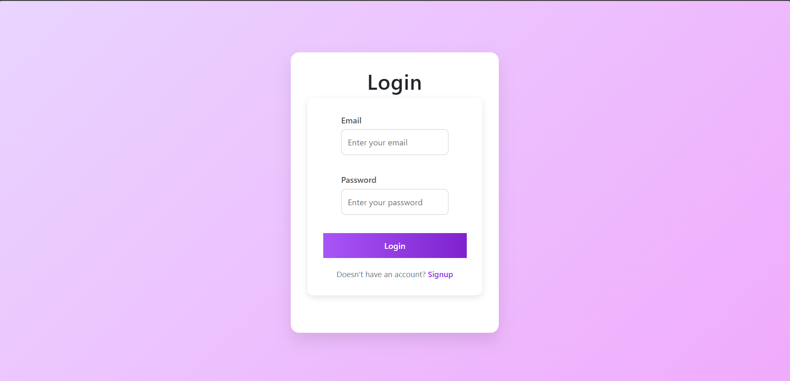
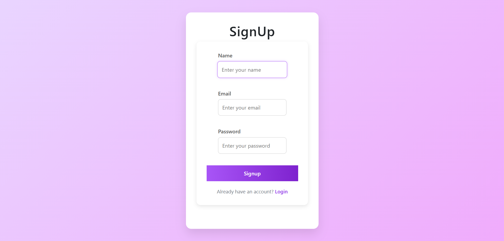
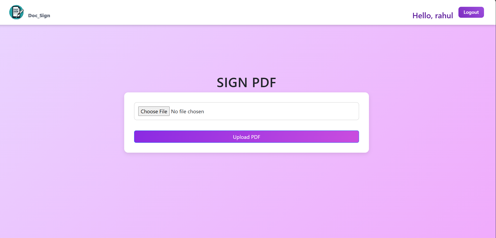
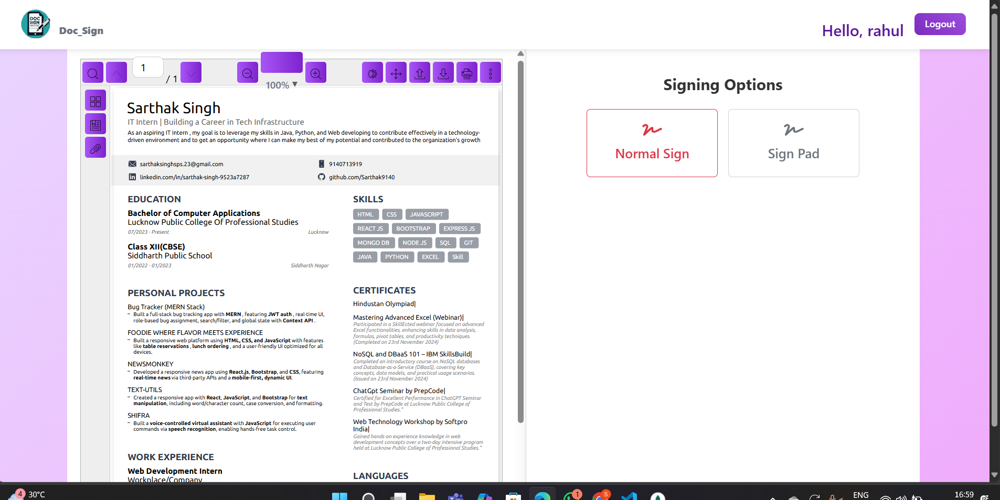
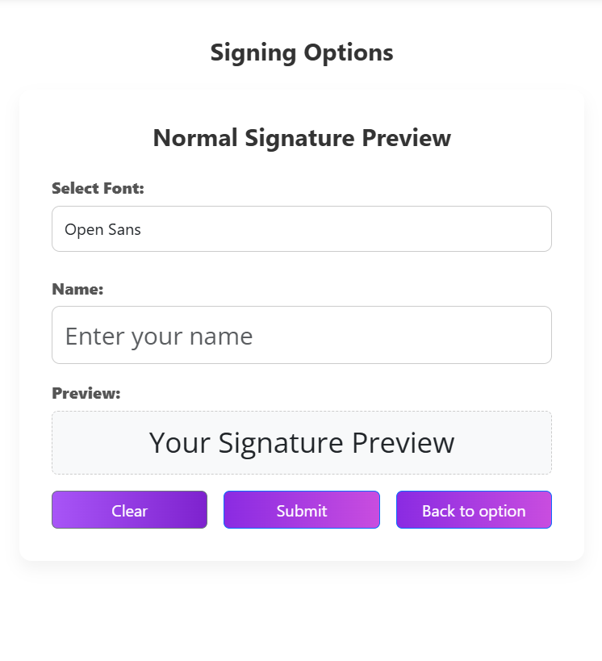
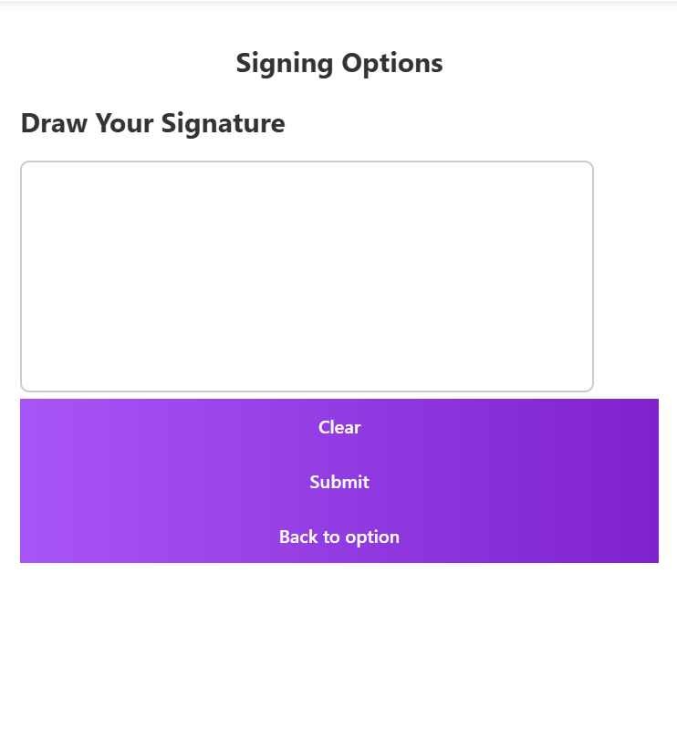

# 🖋️ DOC_SIGN – Digital Document Signing App

DOC_SIGN is a full-stack web application built using the **MERN stack** (MongoDB, Express.js, React.js, Node.js) that allows users to **sign PDF documents online** with two modes: **Normal Signature** and **Sign Pad**. It offers a seamless and user-friendly experience for uploading, signing, and saving documents with drag-and-drop functionality to place the signature wherever needed.

---

## 🔗 Live Demo

> *Coming soon or Add your deployment link here*

---

## 🚀 Features

- 🔐 **Authentication**
  - User Signup & Login
  - JWT-based session handling

- 📄 **PDF Upload**
  - Upload any PDF file to sign

- ✍️ **Two Types of Signatures**
  - **Normal Sign**: Type your name and select from multiple fonts
  - **Draw Sign**: Draw your signature using a digital pad

- 🖱️ **Drag and Position Signature**
  - After creating your signature, **drag and place it anywhere** on the document as per your choice

- 💾 **Save Signed PDF**
  - Download or save the document with the signature embedded

- 📱 **Responsive UI**
  - Optimized for both desktop and mobile views with a clean, modern look

---

## 🛠️ Tech Stack

| Frontend        | Backend         | Database       | Others                   |
|----------------|-----------------|----------------|--------------------------|
| React.js       | Node.js         | MongoDB Atlas  | JWT for Auth             |
| Tailwind CSS   | Express.js      | Mongoose ORM   | File handling with Multer|
| React-PDF      |                 |                | HTML2Canvas & jsPDF      |

---

## 📷 Screenshots

| Login | 

|  | 

| Signup |
 |

| Upload PDF | 
|  |

| Signature Option |
|  |

| Normal Signature Option |
|  |

| Signature Pad Option |
|  |

| Signature Submit |
|  |


## 🧑‍💻 Getting Started

### 1. Clone the Repository
```bash
git clone https://github.com/Sarthak9140/doc_sign.git
cd doc_sign

2. Setup Server
cd server
npm install
npm start

3. Setup Client
cd client
npm install
npm start
Make sure MongoDB is running and update your environment variables accordingly in both client/.env and server/.env.

📂 Folder Structure
doc_sign/
├── client/         # React frontend
│   └── src/
│       └── components/
├── index /         # Node.js backend
│   └── routes/
│   └── controllers/
│   └── middlewares/
│   └── models/
✍️ Author

Vansh